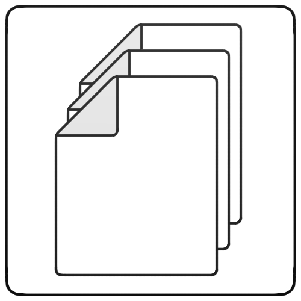

# Main page
The main page is used to manage levels and data.

## Search
The top row displays a textbox with a 'Search' and 'Reset' button. This search textbox can be used to search for data and level items by name. To run a search you can enter the text to search for into the textbox and click on 'Search'. The 'Reset' button can be used to reset the search. The 'Reset' button also returns you to the base level.

## Navigation
Besides the search box are also a back and forward button these can be used to go through the history of searches and levels. To enter a level a double click on a level item is needed. To return to the parent level a double click on the '..' level is needed.

## Main content
The main content of the page is the levels and items of the current level. There are three different icons.

The level icon is displayed for items that are levels.

This icon is displayed if a data item contains files or directories.

This icon is displayed if a data item contains text.

By clicking on an icon or text it is possible to select this item. A selected item is highlighted by a blue background.

## Buttons
On the bottom of the page are several buttons:
- Add: This button let's you add text or data to the CryptoForest and will display the [Add data](AddData.md) page.
- Decrypt: This button let's you decrypt the selected data / text item. If the item is a data item a directory needs to be selected to decrypt the files and directories to. A decrypted text item is directly displayed in the popup.
- Delete: This button let's you remove the selected item. All types of items can be removed with this button.
- Move: This button let's you move a data / text item from one level to another one. After clicking a pop-up is displayed where you can select the new level.
- Add level: This button let's you add a level to the level structure and will display the [Add level](AddLevel.md) page.
- Export: This button let's you export a configuration to open the levels of the CryptoForest again and will dislay the [Export config](ExportConfig.md) page.
